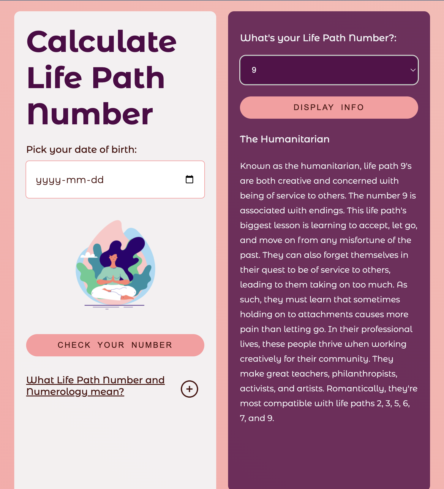

# Calculate Life Path Number App

## Breaking down the code

Numerology Calculation Function:

`calculateNumerology`: Takes a date as input, removes dashes, converts it into an array of digits, calculates the sum of the digits, and handles special cases (11, 22, 33, 44) by returning the sum. If the sum is two digits, it continues reducing until a single-digit number is obtained.

Button Click Event:

Listens for a click on the button with the ID `calculateBtn`,
Retrieves the birthdate input, calculates the numerology number using the calculateNumerology function, and displays the result in the HTML.

Display Information Event:

Listens for a click on the element with the ID `displayInfoBtn.`
Retrieves the selected numerology number from the HTML select element.
Fetches information from a JSON file ("data.json") based on the selected number.
Displays the fetched information using the displayNumerologyInfo function.

JSON file was made manually by me, as I couldn't find any suitable public API:s which I could use for the project. I used the info from the websites: `https://www.mindbodygreen.com/` and `https://askastrology.com/`.
Display Numerology Information Function:

`displayNumerologyInfo`: Takes an object info and displays its properties (nick and description) in the HTML.

Accordion Toggle Event:

Listens for a click on the element with the ID `accordionSection.`
Toggles the "active" class on the element, presumably for accordion functionality.

## Demo

Click <a href="https://melodic-moxie-23f251.netlify.app/"> here </href>.